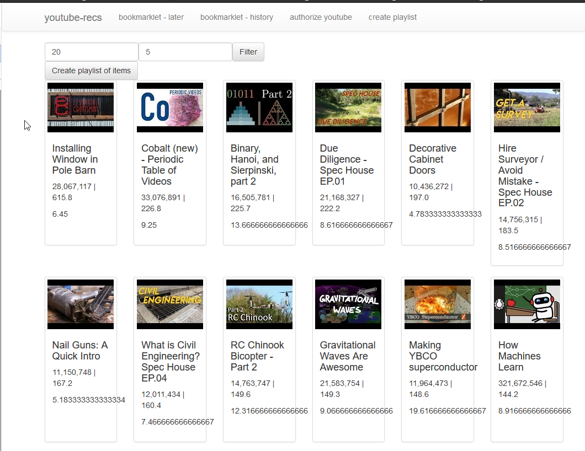

# youtube-recs

This is a quick server which is used to make better Youtube playlists.  It uses a combination of your Watch Later, Watch History, and the Youtube API to provide better playlists.



## endpoints

index: this will be used to create a landing page with some other functionality

watched: this will be a get request that can add watched videos to the DB

later: this will be a get request that can add videos to watch later to the DB

## instructions

To get started, run install all of the components for the client and server:

```
yarn
cd client
yarn
```

Once those are installed, get back to the server root, and run the server and client:

```
yarn start
```

That should automatically open the development window at `localhost:3000` which will provide the React interface.  From there, you can hit `Authorize Youtube` to trigger the token generation and storage.

After that, hit `Create Playlist` to get a top 20 based on the videos in the database.

To load more files, use the bookmarklets.  They are currently only correct when compiled from source:

```
tsc
```

From there, check out `build/youtube-recs` and copy the code and run in the browser console.  The pages should be looking at your Watch Later playlist and History pages respectively.